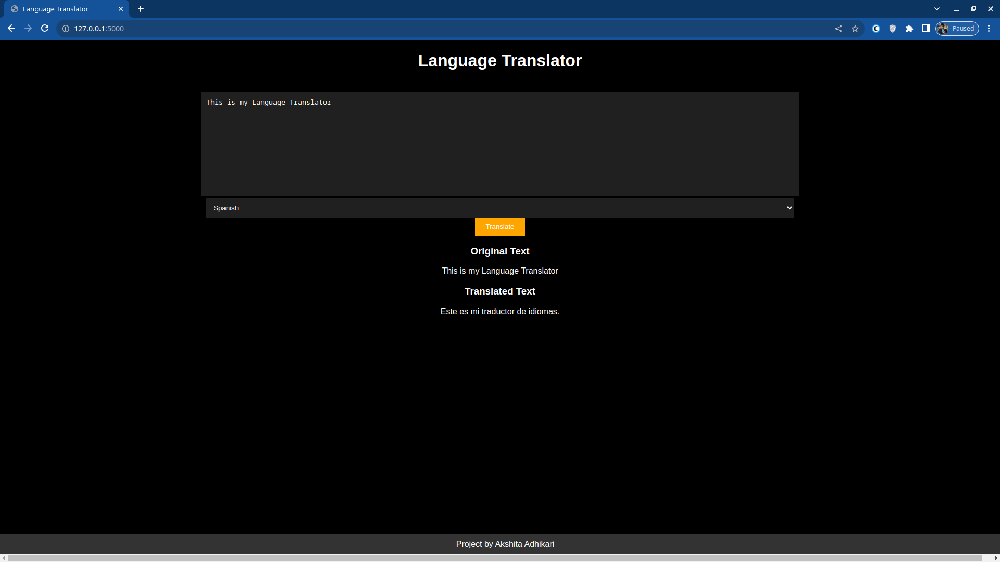

# CodeAlpha_Language_Translator

CodeAlpha Language Translator is a simple web application that allows users to enter text, detect its language, and translate it into a different language of their choice.



## Getting Started

Follow these steps to set up and run the application locally:

1. Clone the repository:

   ```bash
   git clone https://github.com/akshitaadhikari/CodeAlpha_Language_Translator.git

2. Navigate to the project directory:

    ```bash
    cd CodeAlpha_Language_Translator
    
3. Install the required dependencies:

    ```bash
    pip install -r requirements.txt
    
4. Run the app.py file to start the server

    ```bash
    python app.py
    
5. Open your web browser and go to the local host mentioned on the screen (usually http://127.0.0.1:5000/).
   


## Usage

1. Enter the text you want to translate into the left textarea.
2. Click the "Detect Language" button to automatically detect the language of the entered text.
3. Choose the target language from the dropdown menu in the right box.
4. Click the "Translate" button to translate the text into the selected language.

## Technologies Used

- HTML
- CSS
- JavaScript
- Flask (Python Web Framework)
- Google Translate API

## Credits

- Google Translate API: [Google Translate API](https://cloud.google.com/translate/docs)

## License

This project is licensed under the MIT License - see the [LICENSE](LICENSE) file for details.

